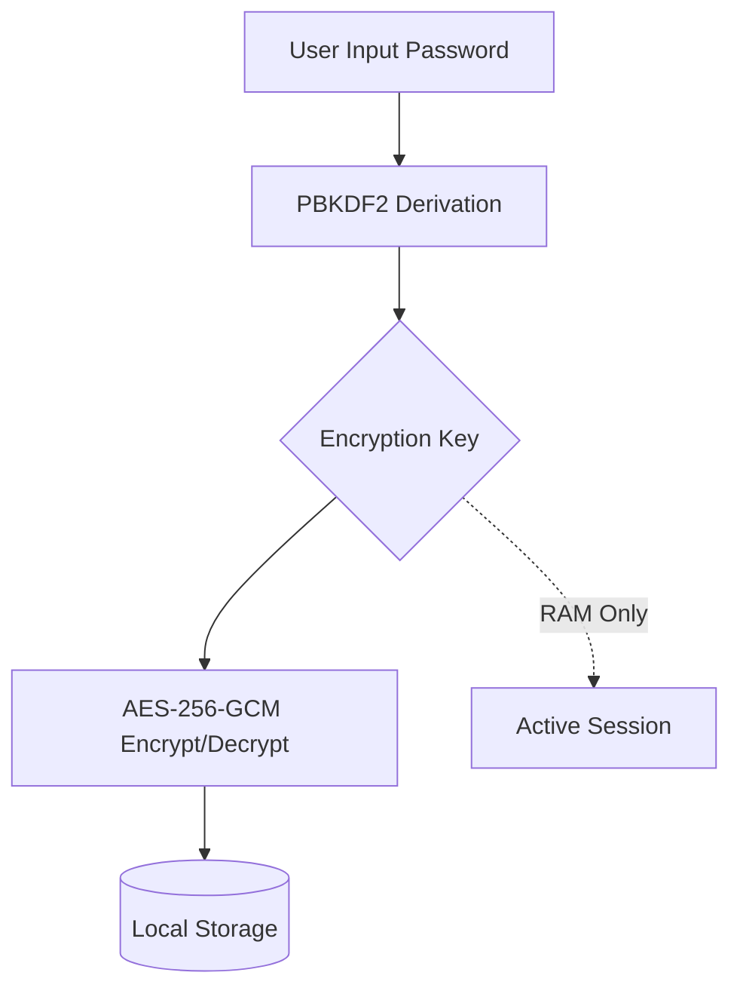

# TMPT — Platform Data Personal Zero-Knowledge

[](https://opensource.org/licenses/MIT)
[](#)
[](#)

**TMPT** (dibaca "tempat") adalah platform web statis berbasis browser yang menjadi wadah untuk berbagai aplikasi produktivitas dengan prinsip **Zero-Knowledge** dan **Local-First**. Semua data Anda disimpan secara lokal di browser, terenkripsi, tanpa server, dan tanpa mengirimkan data ke pihak mana pun.

> **Tagline:** "Tempat data kamu, bukan tempat data orang lain."

---

## 🚀 Fungsi Project

TMPT dirancang untuk pengguna yang mengutamakan privasi dan keamanan data. Aplikasi pertama yang tersedia adalah **BRANKAS**, sebuah pengelola kredensial (password manager) dan informasi penting pribadi.

- **Zero-Knowledge:** Password master dan kunci enkripsi tidak pernah meninggalkan perangkat Anda.
- **Offline-First:** Setelah dimuat, aplikasi dapat berjalan sepenuhnya tanpa koneksi internet.
- **Static Web:** Di-host di GitHub Pages sebagai aplikasi web statis murni.

---

## 🛠 Teknologi yang Digunakan

| Layer | Teknologi |
|---|---|
| **Styling** | [PicoCSS](https://picocss.com) (Classless & Minimalist) |
| **Interactivity** | [HTMX](https://htmx.org) + Vanilla JavaScript (ES6+) |
| **Kriptografi** | [Web Crypto API](https://developer.mozilla.org/en-US/docs/Web/API/Web_Crypto_API) (Native Browser) |
| **Penyimpanan** | `localStorage` (Persisten) & `sessionStorage` (Sesi) |
| **Ikon** | [Tabler Icons](https://tabler-icons.io) (SVG Sprite) |

---

## 📂 Struktur Project

```text
tmpt.my.id/
├── assets/             # Aset statis
│   ├── css/            # Style CSS (Custom & Overrides)
│   ├── js/             # Logika utama (Crypto, Auth, Vault, UI)
│   └── img/            # Gambar dan media
├── shared/             # Komponen UI parsial (HTML)
├── docs/               # Dokumentasi (PRD, Rencana Implementasi)
├── bin/                # Script utilitas (Helper dev)
├── index.html          # Halaman Landing Page (Entry Point)
├── TASKS.md            # Daftar tugas pengembangan
└── README.md           # Dokumentasi utama
```

---

## ⚙️ Cara Menjalankan (Development)

Aplikasi ini tidak membutuhkan proses build atau kompilasi. Namun, karena fitur **Web Crypto API** dan **HTMX** memerlukan protokol HTTP, Anda disarankan menggunakan server lokal.

### Opsi 1: Menggunakan Python
```powershell
python -m http.server 8000
```
Buka `http://localhost:8000` di browser Anda.

### Opsi 2: Menggunakan Node.js (npx)
```powershell
npx serve .
```

### Rebuild PWA
```powershell
npm run pwa:rebuild
```
---

## 🏗 Arsitektur & Keamanan

TMPT menggunakan enkripsi **AES-256-GCM** dengan derivasi kunci **PBKDF2** (100.000 iterasi).



---

## 🐳 Docker Setup

Jika Anda ingin menjalankan TMPT dalam container Docker:

```bash
# Build image
docker build -t tmpt-app .

# Run container
docker run -d -p 8080:80 tmpt-app
```
*(Memerlukan file Dockerfile berbasis Nginx/Alpine)*

---

## 🤝 Cara Kontribusi

Kami menerima kontribusi dalam bentuk bug report, saran fitur, maupun pull request.
1. Fork repository ini.
2. Buat branch baru (`git checkout -b feature/nama-fitur`).
3. Commit perubahan Anda (`git commit -m 'Menambah fitur X'`).
4. Push ke branch tersebut (`git push origin feature/nama-fitur`).
5. Buat Pull Request.

---

## ❓ FAQ & Troubleshooting

**Q: Mengapa saya tidak bisa membuka vault setelah clear cache browser?**
A: Data disimpan di `localStorage`. Menghapus data browser (Clear Site Data) akan menghapus vault Anda. Pastikan selalu melakukan **Backup** secara rutin.

**Q: Apakah ada fitur lupa password?**
A: **Tidak.** Ini adalah sistem zero-knowledge. Jika Anda lupa master password dan tidak memiliki backup, data tidak dapat dipulihkan.

**Q: Web Crypto API tidak bekerja di browser saya?**
A: Pastikan Anda mengakses aplikasi via **HTTPS** (atau `localhost` saat dev). Web Crypto memerlukan Secure Context.

---

## 📄 License

Project ini dilisensikan di bawah **MIT License**. Lihat file [LICENSE](LICENSE) untuk detail lebih lanjut.

---

## 🌐 Informasi API & Environment

Karena ini adalah aplikasi statis murni:
- **Environment Variables:** Tidak ada (Semua dikelola di sisi klien).
- **API External:** 
  - HTMX (via CDN)
  - PicoCSS (via CDN)
  - Tabler Icons (via CDN/Local Sprite)
